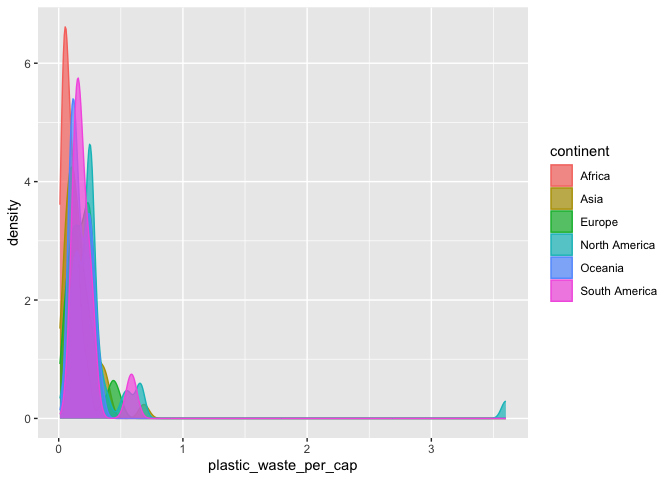
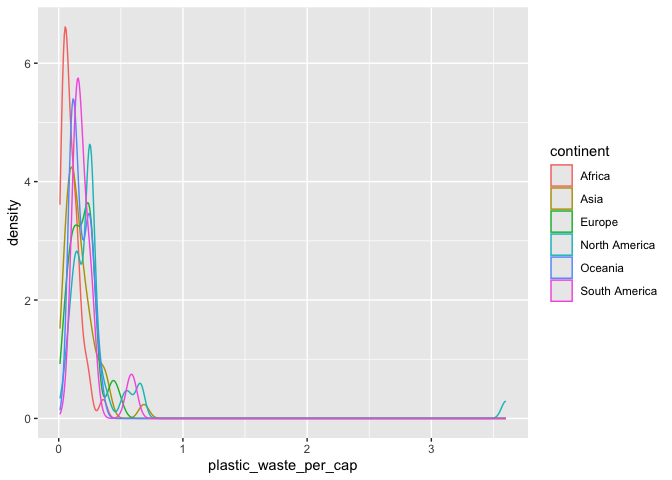

Lab 02 - Plastic waste
================
Zi Li
Jan 27

## Load packages and data

``` r
library(tidyverse) 
```

``` r
plastic_waste <- read.csv("data/plastic-waste.csv")
```

## Exercises

### Exercise 1

``` r
# insert code here
ggplot(data = plastic_waste, aes(x = plastic_waste_per_cap)) +
  geom_histogram(binwidth = 0.2)
```

    ## Warning: Removed 51 rows containing non-finite outside the scale range
    ## (`stat_bin()`).

<!-- -->

``` r
plastic_waste %>%
  filter(plastic_waste_per_cap > 3.5)
```

    ##   code              entity     continent year gdp_per_cap plastic_waste_per_cap
    ## 1  TTO Trinidad and Tobago North America 2010    31260.91                   3.6
    ##   mismanaged_plastic_waste_per_cap mismanaged_plastic_waste coastal_pop
    ## 1                             0.19                    94066     1358433
    ##   total_pop
    ## 1   1341465

## answer: I didn’t expect this result, but after doing some research, I found Trinidad and Tobago is vulnerable to plastic pollution due to its high plastic imports and a lack of recycling infrastructure. Therefore, it’s not a data error.

## plastic waste is high in North America.

### Exercise 2

``` r
# insert code here
ggplot(
  data = plastic_waste,
  aes(x = plastic_waste_per_cap)
) +
  geom_density()
```

    ## Warning: Removed 51 rows containing non-finite outside the scale range
    ## (`stat_density()`).

<!-- -->

``` r
ggplot(
  data = plastic_waste,
  mapping = aes(
    x = plastic_waste_per_cap,
    color = continent
  )
) +
  geom_density()
```

    ## Warning: Removed 51 rows containing non-finite outside the scale range
    ## (`stat_density()`).

<!-- -->

``` r
ggplot(
  data = plastic_waste,
  mapping = aes(
    x = plastic_waste_per_cap,
    color = continent,
    fill = continent
  )
) +
  geom_density()
```

    ## Warning: Removed 51 rows containing non-finite outside the scale range
    ## (`stat_density()`).

<!-- -->

``` r
ggplot(
  data = plastic_waste,
  mapping = aes(
    x = plastic_waste_per_cap,
    color = continent,
    fill = continent
  )
) +
  geom_density(alpha = 0.7)
```

    ## Warning: Removed 51 rows containing non-finite outside the scale range
    ## (`stat_density()`).

<!-- --> \## Ex.
2.1: Recreate the density plots above using a different (lower) alpha
level that works better for displaying the density curves for all
continents.

``` r
ggplot(
  data = plastic_waste,
  aes(x = plastic_waste_per_cap)
) +
  geom_density()
```

    ## Warning: Removed 51 rows containing non-finite outside the scale range
    ## (`stat_density()`).

<!-- -->

``` r
ggplot(
  data = plastic_waste,
  mapping = aes(
    x = plastic_waste_per_cap,
    color = continent
  )
) +
  geom_density()
```

    ## Warning: Removed 51 rows containing non-finite outside the scale range
    ## (`stat_density()`).

<!-- -->

``` r
ggplot(
  data = plastic_waste,
  mapping = aes(
    x = plastic_waste_per_cap,
    color = continent,
    fill = continent
  )
) +
  geom_density()
```

    ## Warning: Removed 51 rows containing non-finite outside the scale range
    ## (`stat_density()`).

<!-- -->

``` r
ggplot(
  data = plastic_waste,
  mapping = aes(
    x = plastic_waste_per_cap,
    color = continent,
    fill = continent
  )
) +
  geom_density(alpha = 0.2)
```

    ## Warning: Removed 51 rows containing non-finite outside the scale range
    ## (`stat_density()`).

<!-- --> \## EX. 2.2:
aesthetic mappings like different color are linked to data variables,
it’s a dynamic way to represent data. Alpha level, is a characteristic
of the geom that maintains visual consistency by controlling element
transparency across the plot. in other word, Alpha level is the
transparency level, which stay unchanged regardless of how data points
are altered.

### Exercise 3

``` r
# insert code here
```

### Exercise 4

Remove this text, and add your answer for Exercise 4 here.

``` r
# insert code here
```

``` r
# insert code here
```

``` r
# insert code here
```

``` r
# insert code here
```

### Exercise 5

Remove this text, and add your answer for Exercise 5 here.

``` r
# insert code here
```
