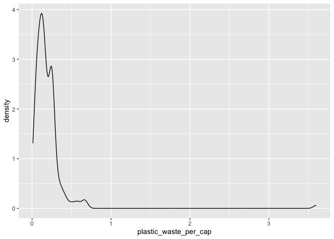
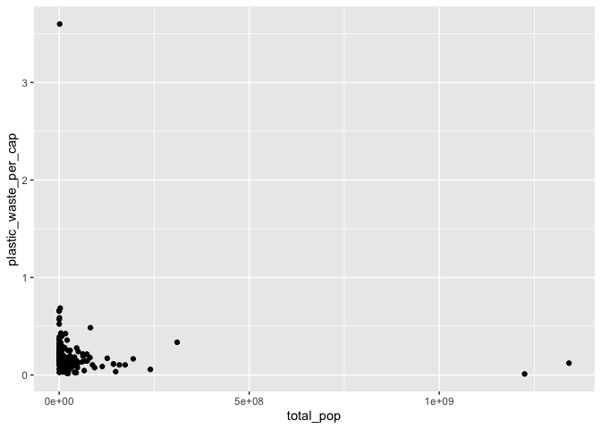
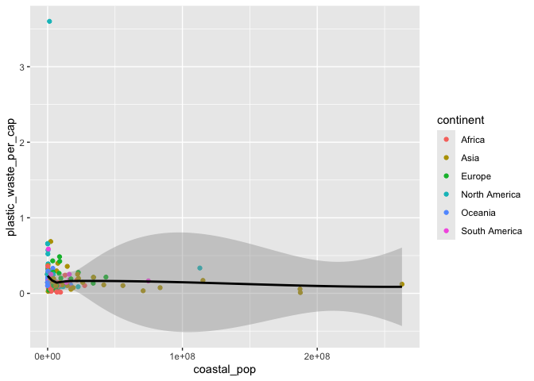

Lab 02 - Plastic waste
================
Zi Li
Jan 27

## Load packages and data

``` r
library(tidyverse) 
```

``` r
plastic_waste <- read.csv("data/plastic-waste.csv")
```

## Exercises

### Exercise 1

``` r
# insert code here
ggplot(data = plastic_waste, aes(x = plastic_waste_per_cap)) +
  geom_histogram(binwidth = 0.2)
```

    ## Warning: Removed 51 rows containing non-finite outside the scale range
    ## (`stat_bin()`).

<!-- -->

``` r
plastic_waste %>%
  filter(plastic_waste_per_cap > 3.5)
```

    ##   code              entity     continent year gdp_per_cap plastic_waste_per_cap
    ## 1  TTO Trinidad and Tobago North America 2010    31260.91                   3.6
    ##   mismanaged_plastic_waste_per_cap mismanaged_plastic_waste coastal_pop
    ## 1                             0.19                    94066     1358433
    ##   total_pop
    ## 1   1341465

## answer: I didn’t expect this result, but after doing some research, I found Trinidad and Tobago is vulnerable to plastic pollution due to its high plastic imports and a lack of recycling infrastructure. Therefore, it’s not a data error.

## plastic waste is high in North America.

### Exercise 2

``` r
# insert code here
ggplot(
  data = plastic_waste,
  aes(x = plastic_waste_per_cap)
) +
  geom_density()
```

    ## Warning: Removed 51 rows containing non-finite outside the scale range
    ## (`stat_density()`).

<!-- -->

``` r
ggplot(
  data = plastic_waste,
  mapping = aes(
    x = plastic_waste_per_cap,
    color = continent
  )
) +
  geom_density()
```

    ## Warning: Removed 51 rows containing non-finite outside the scale range
    ## (`stat_density()`).

<!-- -->

``` r
ggplot(
  data = plastic_waste,
  mapping = aes(
    x = plastic_waste_per_cap,
    color = continent,
    fill = continent
  )
) +
  geom_density()
```

    ## Warning: Removed 51 rows containing non-finite outside the scale range
    ## (`stat_density()`).

<!-- -->

``` r
ggplot(
  data = plastic_waste,
  mapping = aes(
    x = plastic_waste_per_cap,
    color = continent,
    fill = continent
  )
) +
  geom_density(alpha = 0.7)
```

    ## Warning: Removed 51 rows containing non-finite outside the scale range
    ## (`stat_density()`).

<!-- --> \#Ex.
2.1: Recreate the density plots above using a different (lower) alpha
level that works better for displaying the density curves for all
continents.

``` r
ggplot(
  data = plastic_waste,
  aes(x = plastic_waste_per_cap)
) +
  geom_density()
```

    ## Warning: Removed 51 rows containing non-finite outside the scale range
    ## (`stat_density()`).

<!-- -->

``` r
ggplot(
  data = plastic_waste,
  mapping = aes(
    x = plastic_waste_per_cap,
    color = continent
  )
) +
  geom_density()
```

    ## Warning: Removed 51 rows containing non-finite outside the scale range
    ## (`stat_density()`).

<!-- -->

``` r
ggplot(
  data = plastic_waste,
  mapping = aes(
    x = plastic_waste_per_cap,
    color = continent,
    fill = continent
  )
) +
  geom_density()
```

    ## Warning: Removed 51 rows containing non-finite outside the scale range
    ## (`stat_density()`).

<!-- -->

``` r
ggplot(
  data = plastic_waste,
  mapping = aes(
    x = plastic_waste_per_cap,
    color = continent,
    fill = continent
  )
) +
  geom_density(alpha = 0.2)
```

    ## Warning: Removed 51 rows containing non-finite outside the scale range
    ## (`stat_density()`).

<!-- --> \## EX. 2.2:
aesthetic mappings are linked to data variables, it’s a dynamic way to
represent data. Alpha level, is a characteristic of the geom that
maintains visual consistency by controlling element transparency across
the plot. in other word, Alpha level is the transparency level, which
stay unchanged regardless of how data points are altered.

### Exercise 3

\#I filling the color and give my plot a name.

``` r
# insert code here
ggplot(
  data = plastic_waste,
  mapping = aes(
    x = continent,
    y = plastic_waste_per_cap
  )
) +
 geom_boxplot(fill = "skyblue") +
  ggtitle("Box Plot: Plastic Waste per Capita by Continent")
```

    ## Warning: Removed 51 rows containing non-finite outside the scale range
    ## (`stat_boxplot()`).

<!-- -->

``` r
ggplot(
  data = plastic_waste,
  mapping = aes(
    x = continent,
    y = plastic_waste_per_cap
  )
) +
geom_violin(fill = "lightpink", alpha = 0.2) +
  ggtitle("Violin Plot: Plastic Waste per Capita by Continent")
```

    ## Warning: Removed 51 rows containing non-finite outside the scale range
    ## (`stat_ydensity()`).

<!-- -->

\#answer for Ex. 3.1: violin plot reveal the shape and density of the
data; and box plot reveal the median and it also allow for comparisons
of the central tendency.

### Exercise 4

``` r
# insert code here

ggplot(
  data = plastic_waste,
  mapping = aes(
    x = mismanaged_plastic_waste_per_cap,
    y = plastic_waste_per_cap
  )
) +
 geom_point()
```

    ## Warning: Removed 51 rows containing missing values or values outside the scale range
    ## (`geom_point()`).

<!-- -->
\#answer for Ex. 4.1: A large number of data points are concentrated at
lower values for both variables. And it appears to be a weak positive
relationship between plastic waste per capita and mismanaged plastic
waste per capita. As plastic waste per capita increases, mismanaged
plastic waste per capita also tends to increase, tho this trend is not
strongly linear. There is a clear outlier with a very high plastic waste
per capita.

``` r
# insert code here
ggplot(
  data = plastic_waste,
  mapping = aes(
    x = mismanaged_plastic_waste_per_cap,
    y = plastic_waste_per_cap,
    color = continent
  )
) +
 geom_point(alpha = 0.5)
```

    ## Warning: Removed 51 rows containing missing values or values outside the scale range
    ## (`geom_point()`).

<!-- -->
\# answer for Ex 4.2: Africa and Asia: Tend to cluster around low values
for both plastic waste per capita and mismanaged plastic waste per
capita.These regions may generate less plastic waste per person but
maybe struggle with waste management systems. \# Europe and North
America: seems like to have higher plastic waste per capita than Africa
and Asia.But mismanaged plastic waste per capita remains relatively low,
indicating better waste management infrastructure.

# Oceania:Similar to Europe and North America, with low levels of mismanaged plastic waste and relatively high plastic waste per capita. South America: Shows a wide range of variation in mismanaged plastic waste per capita, with some points extending to higher values than other continents.

``` r
# insert code here
ggplot(
  data = plastic_waste,
  mapping = aes(
    x = total_pop,
    y = plastic_waste_per_cap
  )
) +
 geom_point()
```

    ## Warning: Removed 61 rows containing missing values or values outside the scale range
    ## (`geom_point()`).

<!-- -->

``` r
# insert code here
ggplot(
  data = plastic_waste,
  mapping = aes(
    x = coastal_pop,
    y = plastic_waste_per_cap
  )
) +
 geom_point()
```

    ## Warning: Removed 51 rows containing missing values or values outside the scale range
    ## (`geom_point()`).

<!-- -->
\# answer for Ex.4.3 ⬇️

\#for total_pop: The points are clustered near the lower values for
total population, with only a few points spread across higher population
ranges. there’s no clear linear association between totap_pop and
plastic waste per capita. total_pop does not seem to directly predict
plastic waste per cap.

# for coastal_pop: Similar to the total_pop scatterplot, points are concentrated at lower coastal population values, with a few outliers at higher coastal population values.There does not appear to be a strong linear association here either.

# None of of these pairs of variables appear to be more strongly linearly associated than another; hard to identify any trends here.

### Exercise 5

``` r
# insert code here
plastic_waste <- read.csv("data/plastic-waste.csv")

plastic_waste %>%
  filter(plastic_waste_per_cap <= 3.5)
```

    ##     code                           entity     continent year gdp_per_cap
    ## 1    ALB                          Albania        Europe 2010   9927.1818
    ## 2    DZA                          Algeria        Africa 2010  12870.6027
    ## 3    AGO                           Angola        Africa 2010   5897.6828
    ## 4    AIA                         Anguilla North America 2010          NA
    ## 5    ATG              Antigua and Barbuda North America 2010  19212.7201
    ## 6    ARG                        Argentina South America 2010  18712.0631
    ## 7    ABW                            Aruba North America 2010          NA
    ## 8    AUS                        Australia       Oceania 2010  41464.0401
    ## 9    BHS                          Bahamas North America 2010  29221.9912
    ## 10   BHR                          Bahrain          Asia 2010  40570.5357
    ## 11   BGD                       Bangladesh          Asia 2010   2442.7289
    ## 12   BRB                         Barbados North America 2010  16417.9625
    ## 13   BEL                          Belgium        Europe 2010  41085.9189
    ## 14   BLZ                           Belize North America 2010   7876.8096
    ## 15   BEN                            Benin        Africa 2010   1818.7785
    ## 16   BMU                          Bermuda North America 2010  56395.0078
    ## 17   BIH           Bosnia and Herzegovina        Europe 2010   9720.3422
    ## 18   BRA                           Brazil South America 2010  14537.5672
    ## 19   VGB           British Virgin Islands North America 2010          NA
    ## 20   BRN                           Brunei          Asia 2010  80552.8645
    ## 21   BGR                         Bulgaria        Europe 2010  15283.2915
    ## 22   KHM                         Cambodia          Asia 2010   2522.9268
    ## 23   CMR                         Cameroon        Africa 2010   2929.8291
    ## 24   CAN                           Canada North America 2010  40699.3551
    ## 25   CPV                       Cape Verde        Africa 2010   5828.2416
    ## 26   CYM                   Cayman Islands North America 2010          NA
    ## 27   CHL                            Chile South America 2010  19442.0503
    ## 28   CHN                            China          Asia 2010   9525.8185
    ## 29   CXR                 Christmas Island          Asia 2010          NA
    ## 30   CCK                    Cocos Islands          Asia 2010          NA
    ## 31   COL                         Colombia South America 2010  10900.5053
    ## 32   COM                          Comoros        Africa 2010   1412.5027
    ## 33   COG                            Congo        Africa 2010   5186.3448
    ## 34   COK                     Cook Islands       Oceania 2010          NA
    ## 35   CRI                       Costa Rica North America 2010  12999.9922
    ## 36   CIV                    Cote d'Ivoire        Africa 2010   2690.2580
    ## 37   HRV                          Croatia        Europe 2010  20171.9575
    ## 38   CUB                             Cuba North America 2010          NA
    ## 39   CUW                          Curacao North America 2010          NA
    ## 40   CYP                           Cyprus        Europe 2010  33941.1380
    ## 41   CYP                           Cyprus          Asia 2010  33941.1380
    ## 42   COD     Democratic Republic of Congo        Africa 2010    660.2110
    ## 43   DNK                          Denmark        Europe 2010  43998.4367
    ## 44   DJI                         Djibouti        Africa 2010          NA
    ## 45   DMA                         Dominica North America 2010  10198.2734
    ## 46   DOM               Dominican Republic North America 2010  11132.5527
    ## 47   ECU                          Ecuador South America 2010   9352.3442
    ## 48   EGY                            Egypt        Africa 2010   9857.4683
    ## 49   SLV                      El Salvador North America 2010   6300.7754
    ## 50   GNQ                Equatorial Guinea        Africa 2010  33723.3658
    ## 51   ERI                          Eritrea        Africa 2010   1416.3658
    ## 52   EST                          Estonia        Europe 2010  22740.9720
    ## 53   FRO                   Faeroe Islands        Europe 2010          NA
    ## 54   FLK                 Falkland Islands South America 2010          NA
    ## 55   FJI                             Fiji       Oceania 2010   7352.0884
    ## 56   FIN                          Finland        Europe 2010  39848.1345
    ## 57   FRA                           France        Europe 2010  36855.8447
    ## 58   GUF                    French Guiana South America 2010          NA
    ## 59   PYF                 French Polynesia       Oceania 2010          NA
    ## 60   GAB                            Gabon        Africa 2010  15355.7846
    ## 61   GMB                           Gambia        Africa 2010   1644.2424
    ## 62   GEO                          Georgia        Europe 2010   6733.7838
    ## 63   GEO                          Georgia          Asia 2010   6733.7838
    ## 64   DEU                          Germany        Europe 2010  40428.7210
    ## 65   GHA                            Ghana        Africa 2010   3059.3836
    ## 66   GIB                        Gibraltar        Europe 2010          NA
    ## 67   GRC                           Greece        Europe 2010  28726.0793
    ## 68   GRL                        Greenland North America 2010          NA
    ## 69   GRD                          Grenada North America 2010  11177.9997
    ## 70   GLP                       Guadeloupe North America 2010          NA
    ## 71   GUM                             Guam       Oceania 2010          NA
    ## 72   GTM                        Guatemala North America 2010   6714.0636
    ## 73   GGY                         Guernsey        Europe 2010          NA
    ## 74   GIN                           Guinea        Africa 2010   1573.5450
    ## 75   GNB                    Guinea-Bissau        Africa 2010   1400.3633
    ## 76   GUY                           Guyana South America 2010   5847.8573
    ## 77   HTI                            Haiti North America 2010   1502.0327
    ## 78   HND                         Honduras North America 2010   3971.1830
    ## 79   HKG                        Hong Kong          Asia 2010  48107.7086
    ## 80   ISL                          Iceland        Europe 2010  38978.0056
    ## 81   IND                            India          Asia 2010   4404.6970
    ## 82   IDN                        Indonesia          Asia 2010   8433.4974
    ## 83   IRN                             Iran          Asia 2010  17942.8328
    ## 84   IRQ                             Iraq          Asia 2010  12717.5975
    ## 85   IRL                          Ireland        Europe 2010  44030.4141
    ## 86   ISR                           Israel          Asia 2010  29743.0059
    ## 87   ITA                            Italy        Europe 2010  36201.1616
    ## 88   JAM                          Jamaica North America 2010   7996.0195
    ## 89   JPN                            Japan          Asia 2010  35749.7567
    ## 90   JOR                           Jordan          Asia 2010   9472.7683
    ## 91   KEN                            Kenya        Africa 2010   2476.0107
    ## 92   KIR                         Kiribati       Oceania 2010   1731.5386
    ## 93   KWT                           Kuwait          Asia 2010  75204.1451
    ## 94   LVA                           Latvia        Europe 2010  18251.9533
    ## 95   LBN                          Lebanon          Asia 2010  16451.7598
    ## 96   LBR                          Liberia        Africa 2010    699.6537
    ## 97   LBY                            Libya        Africa 2010  29630.2221
    ## 98   LTU                        Lithuania        Europe 2010  21070.6343
    ## 99   MAC                            Macao          Asia 2010  98184.3365
    ## 100  MDG                       Madagascar        Africa 2010   1385.6851
    ## 101  MYS                         Malaysia          Asia 2010  21107.2679
    ## 102  MDV                         Maldives          Asia 2010  12005.5046
    ## 103  MLT                            Malta        Europe 2010  28364.7993
    ## 104  MHL                 Marshall Islands       Oceania 2010   3479.1553
    ## 105  MTQ                       Martinique North America 2010          NA
    ## 106  MRT                       Mauritania        Africa 2010   3316.9748
    ## 107  MUS                        Mauritius        Africa 2010  15938.4192
    ## 108  MEX                           Mexico North America 2010  15715.9721
    ## 109  FSM             Micronesia (country)       Oceania 2010   3297.6569
    ## 110  MCO                           Monaco        Europe 2010          NA
    ## 111  MNE                       Montenegro        Europe 2010  14034.5846
    ## 112  MSR                       Montserrat North America 2010          NA
    ## 113  MAR                          Morocco        Africa 2010   6443.2536
    ## 114  MOZ                       Mozambique        Africa 2010    917.7638
    ## 115  MMR                          Myanmar          Asia 2010   3721.2114
    ## 116  NAM                          Namibia        Africa 2010   8460.8474
    ## 117  NRU                            Nauru       Oceania 2010   6592.4368
    ## 118  NLD                      Netherlands        Europe 2010  45524.6621
    ## 119  ANT             Netherlands Antilles North America 2010          NA
    ## 120  NCL                    New Caledonia       Oceania 2010          NA
    ## 121  NZL                      New Zealand       Oceania 2010  32119.2155
    ## 122  NIC                        Nicaragua North America 2010   4028.7121
    ## 123  NGA                          Nigeria        Africa 2010   5150.1588
    ## 124  NIU                             Niue       Oceania 2010          NA
    ## 125  NFK                   Norfolk Island       Oceania 2010          NA
    ## 126  PRK                      North Korea          Asia 2010          NA
    ## 127  MNP         Northern Mariana Islands       Oceania 2010          NA
    ## 128  NOR                           Norway        Europe 2010  62350.4107
    ## 129  OMN                             Oman          Asia 2010  45335.8525
    ## 130  PAK                         Pakistan          Asia 2010   4283.6073
    ## 131  PLW                            Palau       Oceania 2010  11846.5739
    ## 132  PSE                        Palestine          Asia 2010   4172.7457
    ## 133  PAN                           Panama North America 2010  15628.5922
    ## 134  PNG                 Papua New Guinea       Oceania 2010   3191.5804
    ## 135  PER                             Peru South America 2010   9956.5566
    ## 136  PHL                      Philippines          Asia 2010   5596.8373
    ## 137  POL                           Poland        Europe 2010  21770.6444
    ## 138  PRT                         Portugal        Europe 2010  27238.4607
    ## 139  PRI                      Puerto Rico North America 2010  33924.0540
    ## 140  QAT                            Qatar          Asia 2010 125140.8383
    ## 141  REU                          Reunion        Africa 2010          NA
    ## 142  ROU                          Romania        Europe 2010  17553.2833
    ## 143  RUS                           Russia        Europe 2010  23107.7852
    ## 144  RUS                           Russia          Asia 2010  23107.7852
    ## 145  SHN                     Saint Helena        Africa 2010          NA
    ## 146  KNA            Saint Kitts and Nevis North America 2010  21412.2015
    ## 147  LCA                      Saint Lucia North America 2010  12123.8351
    ## 148  SPM        Saint Pierre and Miquelon North America 2010          NA
    ## 149  VCT Saint Vincent and the Grenadines North America 2010   9915.5776
    ## 150  WSM                            Samoa       Oceania 2010   5399.8931
    ## 151  STP            Sao Tome and Principe        Africa 2010   2641.5139
    ## 152  SAU                     Saudi Arabia          Asia 2010  45421.2285
    ## 153  SEN                          Senegal        Africa 2010   2183.9951
    ## 154  SYC                       Seychelles        Africa 2010  20365.1189
    ## 155  SLE                     Sierra Leone        Africa 2010   1199.9899
    ## 156  SGP                        Singapore          Asia 2010  72115.8395
    ## 157  SXM        Sint Maarten (Dutch part) North America 2010          NA
    ## 158  SVN                         Slovenia        Europe 2010  28678.3726
    ## 159  SLB                  Solomon Islands       Oceania 2010   1871.3694
    ## 160  SOM                          Somalia        Africa 2010          NA
    ## 161  ZAF                     South Africa        Africa 2010  11887.8050
    ## 162  KOR                      South Korea          Asia 2010  30352.1048
    ## 163  ESP                            Spain        Europe 2010  32507.0940
    ## 164  LKA                        Sri Lanka          Asia 2010   8529.5714
    ## 165  SDN                            Sudan        Africa 2010   3366.0963
    ## 166  SUR                         Suriname South America 2010  14211.8775
    ## 167  SWE                           Sweden        Europe 2010  42942.5625
    ## 168  SYR                            Syria          Asia 2010          NA
    ## 169  TWN                           Taiwan          Asia 2010          NA
    ## 170  TZA                         Tanzania        Africa 2010   2090.5832
    ## 171  THA                         Thailand          Asia 2010  13486.5624
    ## 172  TGO                             Togo        Africa 2010   1208.2812
    ## 173  TKL                          Tokelau       Oceania 2010          NA
    ## 174  TON                            Tonga       Oceania 2010   4984.1936
    ## 175  TUN                          Tunisia        Africa 2010  10436.3656
    ## 176  TUR                           Turkey        Europe 2010  17959.2591
    ## 177  TUR                           Turkey          Asia 2010  17959.2591
    ## 178  TCA         Turks and Caicos Islands North America 2010          NA
    ## 179  TUV                           Tuvalu       Oceania 2010   2986.4499
    ## 180  UKR                          Ukraine        Europe 2010   7824.4985
    ## 181  ARE             United Arab Emirates          Asia 2010  57232.6181
    ## 182  GBR                   United Kingdom        Europe 2010  36366.9832
    ## 183  USA                    United States North America 2010  49374.1789
    ## 184  URY                          Uruguay South America 2010  17082.4047
    ## 185  VUT                          Vanuatu       Oceania 2010   2948.0329
    ## 186  VEN                        Venezuela South America 2010  16544.9721
    ## 187  VNM                          Vietnam          Asia 2010   4408.1686
    ## 188  YEM                            Yemen          Asia 2010   4478.7436
    ##     plastic_waste_per_cap mismanaged_plastic_waste_per_cap
    ## 1                   0.069                            0.032
    ## 2                   0.144                            0.086
    ## 3                   0.062                            0.045
    ## 4                   0.252                            0.010
    ## 5                   0.660                            0.051
    ## 6                   0.183                            0.026
    ## 7                   0.252                            0.007
    ## 8                   0.112                            0.002
    ## 9                   0.390                            0.011
    ## 10                  0.132                            0.016
    ## 11                  0.034                            0.030
    ## 12                  0.570                            0.034
    ## 13                  0.080                            0.002
    ## 14                  0.172                            0.053
    ## 15                  0.043                            0.036
    ## 16                  0.252                            0.005
    ## 17                  0.144                            0.061
    ## 18                  0.165                            0.017
    ## 19                  0.252                            0.005
    ## 20                  0.026                            0.001
    ## 21                  0.154                            0.051
    ## 22                  0.066                            0.058
    ## 23                  0.046                            0.038
    ## 24                  0.093                            0.002
    ## 25                  0.065                            0.049
    ## 26                  0.252                            0.005
    ## 27                  0.119                            0.011
    ## 28                  0.121                            0.092
    ## 29                  0.252                            0.005
    ## 30                  0.252                            0.005
    ## 31                  0.144                            0.034
    ## 32                  0.201                            0.169
    ## 33                  0.069                            0.054
    ## 34                  0.144                            0.054
    ## 35                  0.258                            0.047
    ## 36                  0.103                            0.086
    ## 37                  0.252                            0.028
    ## 38                  0.089                            0.022
    ## 39                  0.252                            0.005
    ## 40                  0.248                            0.006
    ## 41                  0.248                            0.006
    ## 42                  0.045                            0.039
    ## 43                  0.047                            0.001
    ## 44                  0.103                            0.076
    ## 45                  0.149                            0.031
    ## 46                  0.144                            0.039
    ## 47                  0.147                            0.047
    ## 48                  0.178                            0.122
    ## 49                  0.147                            0.051
    ## 50                  0.144                            0.047
    ## 51                  0.045                            0.035
    ## 52                  0.176                            0.019
    ## 53                  0.252                            0.005
    ## 54                  0.252                            0.005
    ## 55                  0.189                            0.151
    ## 56                  0.234                            0.005
    ## 57                  0.192                            0.004
    ## 58                  0.144                            0.039
    ## 59                  0.252                            0.013
    ## 60                  0.054                            0.019
    ## 61                  0.048                            0.041
    ## 62                  0.068                            0.035
    ## 63                  0.068                            0.035
    ## 64                  0.485                            0.010
    ## 65                  0.040                            0.032
    ## 66                  0.252                            0.005
    ## 67                  0.200                            0.004
    ## 68                  0.252                            0.005
    ## 69                  0.325                            0.064
    ## 70                  0.144                            0.039
    ## 71                  0.252                            0.006
    ## 72                  0.280                            0.105
    ## 73                  0.252                            0.005
    ## 74                  0.030                            0.025
    ## 75                  0.054                            0.046
    ## 76                  0.586                            0.224
    ## 77                  0.090                            0.044
    ## 78                  0.189                            0.079
    ## 79                  0.398                            0.010
    ## 80                  0.281                            0.006
    ## 81                  0.010                            0.009
    ## 82                  0.057                            0.047
    ## 83                  0.144                            0.074
    ## 84                  0.103                            0.067
    ## 85                  0.430                            0.009
    ## 86                  0.297                            0.008
    ## 87                  0.134                            0.003
    ## 88                  0.034                            0.010
    ## 89                  0.171                            0.003
    ## 90                  0.144                            0.086
    ## 91                  0.027                            0.023
    ## 92                  0.103                            0.088
    ## 93                  0.686                            0.014
    ## 94                  0.124                            0.020
    ## 95                  0.094                            0.034
    ## 96                  0.084                            0.072
    ## 97                  0.144                            0.036
    ## 98                  0.132                            0.021
    ## 99                  0.368                            0.007
    ## 100                 0.016                            0.013
    ## 101                 0.198                            0.112
    ## 102                 0.322                            0.220
    ## 103                 0.214                            0.018
    ## 104                 0.192                            0.150
    ## 105                 0.252                            0.005
    ## 106                 0.045                            0.038
    ## 107                 0.230                            0.122
    ## 108                 0.087                            0.012
    ## 109                 0.103                            0.085
    ## 110                 0.252                            0.005
    ## 111                 0.144                            0.046
    ## 112                 0.144                            0.020
    ## 113                 0.073                            0.049
    ## 114                 0.015                            0.013
    ## 115                 0.075                            0.066
    ## 116                 0.144                            0.097
    ## 117                 0.144                            0.099
    ## 118                 0.424                            0.008
    ## 119                 0.252                            0.005
    ## 120                 0.252                            0.005
    ## 121                 0.331                            0.007
    ## 122                 0.143                            0.066
    ## 123                 0.103                            0.085
    ## 124                 0.252                            0.006
    ## 125                 0.103                            0.086
    ## 126                 0.054                            0.048
    ## 127                 0.252                            0.006
    ## 128                 0.280                            0.006
    ## 129                 0.084                            0.005
    ## 130                 0.103                            0.090
    ## 131                 0.144                            0.084
    ## 132                 0.063                            0.005
    ## 133                 0.145                            0.029
    ## 134                 0.103                            0.090
    ## 135                 0.144                            0.039
    ## 136                 0.075                            0.062
    ## 137                 0.097                            0.013
    ## 138                 0.265                            0.005
    ## 139                 0.252                            0.011
    ## 140                 0.160                            0.003
    ## 141                 0.144                            0.003
    ## 142                 0.042                            0.011
    ## 143                 0.112                            0.020
    ## 144                 0.112                            0.020
    ## 145                 0.144                            0.039
    ## 146                 0.654                            0.054
    ## 147                 0.522                            0.113
    ## 148                 0.252                            0.005
    ## 149                 0.221                            0.051
    ## 150                 0.103                            0.084
    ## 151                 0.103                            0.085
    ## 152                 0.156                            0.016
    ## 153                 0.103                            0.086
    ## 154                 0.358                            0.139
    ## 155                 0.041                            0.035
    ## 156                 0.194                            0.004
    ## 157                 0.252                            0.005
    ## 158                 0.145                            0.005
    ## 159                 0.103                            0.090
    ## 160                 0.054                            0.047
    ## 161                 0.240                            0.134
    ## 162                 0.112                            0.001
    ## 163                 0.277                            0.006
    ## 164                 0.357                            0.299
    ## 165                 0.103                            0.083
    ## 166                 0.163                            0.027
    ## 167                 0.048                            0.001
    ## 168                 0.178                            0.119
    ## 169                 0.252                            0.006
    ## 170                 0.023                            0.020
    ## 171                 0.144                            0.108
    ## 172                 0.057                            0.049
    ## 173                 0.103                            0.086
    ## 174                 0.223                            0.176
    ## 175                 0.144                            0.088
    ## 176                 0.212                            0.039
    ## 177                 0.212                            0.039
    ## 178                 0.252                            0.006
    ## 179                 0.144                            0.108
    ## 180                 0.103                            0.052
    ## 181                 0.199                            0.004
    ## 182                 0.215                            0.004
    ## 183                 0.335                            0.007
    ## 184                 0.252                            0.024
    ## 185                 0.295                            0.245
    ## 186                 0.252                            0.017
    ## 187                 0.103                            0.090
    ## 188                 0.103                            0.077
    ##     mismanaged_plastic_waste coastal_pop  total_pop
    ## 1                      29705     2530533    3204284
    ## 2                     520555    16556580   35468208
    ## 3                      62528     3790041   19081912
    ## 4                         52       14561      15358
    ## 5                       1253       66843      88710
    ## 6                     157777    16449245   40412376
    ## 7                        372      137910     107488
    ## 8                      13889    17235954   22268384
    ## 9                       1333      341145     342877
    ## 10                      4376      743574    1261835
    ## 11                    787327    70874124  148692131
    ## 12                      3483      276784     273331
    ## 13                      2743     4747957   10712066
    ## 14                      3892      202429     311627
    ## 15                     43015     3235418    8849892
    ## 16                       123       66966      64941
    ## 17                     12955      585582    3760149
    ## 18                    471404    74696771  194946470
    ## 19                        55       29674      23245
    ## 20                        93      359871     398920
    ## 21                     18739     1002695    7494332
    ## 22                     29686     1391254   14138255
    ## 23                     27713     1986723   19598889
    ## 24                      7959    11846863   34016593
    ## 25                      9347      522245     495999
    ## 26                        95       51864      56230
    ## 27                     21754     5621550   17113688
    ## 28                   8819717   262892387 1341335152
    ## 29                         3        1402       1400
    ## 30                         1         596        596
    ## 31                     92173     7498563   46294841
    ## 32                     58032      938595     734750
    ## 33                     16766      847807    4042899
    ## 34                       416       20934      20288
    ## 35                     42090     2479298    4658887
    ## 36                    194558     6230583   19737800
    ## 37                     16461     1602782    4403330
    ## 38                     90630    11333471   11257979
    ## 39                       268      143784         NA
    ## 40                      1821      840556    1103647
    ## 41                      1821      840556    1103647
    ## 42                     15208     1076056   65965795
    ## 43                      1791     5376386    5550142
    ## 44                     17324      621744     888716
    ## 45                       783       70138      67757
    ## 46                    118226     8232586    9927320
    ## 47                    109383     6400048   14464739
    ## 48                    967012    21750943   81121077
    ## 49                    118732     6410726    6192993
    ## 50                      5977      351600     700401
    ## 51                     16259     1266222    5253676
    ## 52                      5979      878021    1341140
    ## 53                        93       50554      48708
    ## 54                         5        2602         NA
    ## 55                     49257      896145     860623
    ## 56                      4985     2927674    5364546
    ## 57                     24109    17287280   62787427
    ## 58                      2360      167631     231151
    ## 59                      1286      270618     270764
    ## 60                      6087      862328    1505463
    ## 61                     19616     1324214    1728394
    ## 62                     14472     1124249    4352244
    ## 63                     14472     1124249    4352244
    ## 64                     31239     8837035   82302465
    ## 65                     91571     7727702   24391823
    ## 66                        65       33483      29244
    ## 67                     14229     9794702   11359346
    ## 68                       105       57068      57296
    ## 69                      2248       96121     104487
    ## 70                      6564      466166     460666
    ## 71                       393      190809     179896
    ## 72                     91563     2392442   14388929
    ## 73                       103       56289         NA
    ## 74                     18514     1996496    9981590
    ## 75                     20240     1208106    1515224
    ## 76                     42002      513235     754493
    ## 77                    147389     9155693    9993247
    ## 78                     95638     3324144    7600524
    ## 79                     28512     7573074    7053189
    ## 80                       598      292708     320136
    ## 81                    599819   187493433 1224614327
    ## 82                   3216856   187223476  239870937
    ## 83                    247403     9099695   73973630
    ## 84                     15563      639228   31671591
    ## 85                     11710     3749576    4469900
    ## 86                     19007     6677810    7418400
    ## 87                     32761    33822532   60550848
    ## 88                     10019     2820558    2741052
    ## 89                    143121   115228891  126535920
    ## 90                      1737       55392    6187227
    ## 91                     22658     2729945   40512682
    ## 92                      3045       94487      99546
    ## 93                     11489     2293604    2736732
    ## 94                     10284     1432078    2252060
    ## 95                     47815     3890871    4227597
    ## 96                     56728     2148271    3994122
    ## 97                     52779     4050128    6355112
    ## 98                      3479      443894    3323611
    ## 99                       698      257911     543656
    ## 100                    34522     7062413   20713819
    ## 101                   936818    22890252   28401017
    ## 102                    31469      392567     315885
    ## 103                     2620      404707     416515
    ## 104                     3187       58086      54038
    ## 105                      749      402257     405814
    ## 106                    13854     1005481    3459773
    ## 107                    56051     1255952    1299172
    ## 108                   101343    22647771  113423047
    ## 109                     4794      154895         NA
    ## 110                       62       34050      35407
    ## 111                     4416      260336     631490
    ## 112                       38        5173       5934
    ## 113                   310126    17303431   31951412
    ## 114                    45995     9566559   23390765
    ## 115                   458269    18988522   47963012
    ## 116                     5480      155084    2283289
    ## 117                      554       15289      10255
    ## 118                    27700     8971770   16612988
    ## 119                      416      227165         NA
    ## 120                      472      257904     250870
    ## 121                     9286     3862054    4368136
    ## 122                    84415     3482653    5788163
    ## 123                   851493    27477112  158423182
    ## 124                        4        1799       1468
    ## 125                       68        2156         NA
    ## 126                   304328    17327483   24346229
    ## 127                      219      106256      60917
    ## 128                     8403     4131679    4883111
    ## 129                     4658     2597556    2782435
    ## 130                   480493    14581952  173593383
    ## 131                      716       23446      20472
    ## 132                     5599     3045258         NA
    ## 133                    34388     3249531    3516820
    ## 134                    89835     2747514    6858266
    ## 135                   194453    13765608   29076512
    ## 136                  1883659    83446862   93260798
    ## 137                    15703     3272933   38276660
    ## 138                    16402     8507951   10675572
    ## 139                    16517     4249848    3749009
    ## 140                      758      653007    1758793
    ## 141                      847      809426     846068
    ## 142                     3610      875170   21486371
    ## 143                    80759    10812537  142958164
    ## 144                    80759    10812537  142958164
    ## 145                       96        6839       4118
    ## 146                      715       36102      52402
    ## 147                     6709      163227     174267
    ## 148                       11        5888         NA
    ## 149                     2245      120149     109333
    ## 150                     5122      168025     183081
    ## 151                     5081      163740     165397
    ## 152                    20552     3593471   27448086
    ## 153                   254770     8125063   12433728
    ## 154                     4619       91361      86518
    ## 155                    36408     2887017    5867536
    ## 156                     6472     4492494    5086418
    ## 157                       70       37429         NA
    ## 158                      556      336594    2029680
    ## 159                    20394      618678     538148
    ## 160                   101531     5971169    9330872
    ## 161                   630005    12899201   50132817
    ## 162                    33747    41654619   48183584
    ## 163                    45853    22771488   46076989
    ## 164                  1591179    14568174   20859949
    ## 165                    22928      752529   34136520
    ## 166                     3942      402263     524636
    ## 167                     2150     6202234    9379687
    ## 168                   157904     3621997   20410606
    ## 169                    45718    22211567   23025000
    ## 170                    48586     6688695   44841226
    ## 171                  1027739    26043442   69122234
    ## 172                    35401     1991642    6027798
    ## 173                       43        1379       1135
    ## 174                     6624      102872     104058
    ## 175                   234309     7274973   10480934
    ## 176                   485937    34042862   72752325
    ## 177                   485937    34042862   72752325
    ## 178                       49       22570      38354
    ## 179                      457       11563       9827
    ## 180                   128765     6812799   45448329
    ## 181                     3016     2018302    7511690
    ## 182                    67549    43258889   62035570
    ## 183                   275424   112925034  310383948
    ## 184                    21562     2433597    3368786
    ## 185                    22478      251851     239651
    ## 186                   102333    16094897   28979857
    ## 187                  1833819    55858245   87848445
    ## 188                   169181     6048920         NA

``` r
plastic_waste$coastal_pop_proportion <- plastic_waste$coastal_pop / plastic_waste$total_pop

ggplot(
  data = plastic_waste,
  mapping = aes(
    x = coastal_pop,
    y = plastic_waste_per_cap,
    color = continent
  )
) +
 geom_smooth()
```

    ## `geom_smooth()` using method = 'loess' and formula = 'y ~ x'

    ## Warning: Removed 51 rows containing non-finite outside the scale range
    ## (`stat_smooth()`).

<!-- -->
